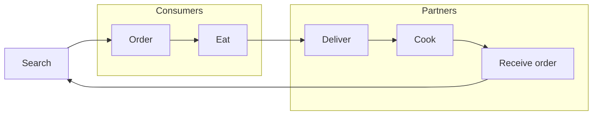

# Product Requirements Document (PRD)

## Project: Food Delivery Platform (Inspired by Just Eat Takeaway.com)

---

## 1. Problem Statement
Consumers want a convenient way to order food from local restaurants and have it delivered to their location. Restaurants need a reliable platform to receive, process, and fulfill orders efficiently.

## 2. Goals & Objectives
- Enable consumers to search for restaurants, place orders, and make payments online.
- Allow restaurant partners to receive, process, and fulfill orders.
- Provide a seamless delivery experience.
- Ensure secure handling of user data and payments.

## 3. User Roles
- **Consumer**: Searches, orders, pays, and receives food.
- **Restaurant Partner**: Receives and fulfills orders.
- **Delivery Partner**: Delivers food to consumers.
- **Admin**: Manages users, restaurants, and orders.

## 4. User Stories
- As a consumer, I want to search for restaurants and menu items so I can find food I like.
- As a consumer, I want to place an order and pay online so I can get food delivered.
- As a restaurant partner, I want to receive orders in real-time so I can prepare food promptly.
- As a delivery partner, I want to see delivery assignments so I can deliver food efficiently.
- As an admin, I want to manage users, restaurants, and orders to ensure smooth operations.

## 5. Features
### Consumer
- Search restaurants and menu items
- View restaurant profiles and menus
- Place orders and make payments
- Track order status
- Rate and review orders

### Restaurant Partner
- Receive and manage orders
- Update order status (accepted, cooking, ready, completed)
- Manage menu and restaurant profile

### Delivery Partner
- View assigned deliveries
- Update delivery status (picked up, delivered)

### Admin
- Manage users, restaurants, and delivery partners
- View analytics and reports

## 6. Technical Requirements
- Laravel 8+
- MySQL database
- RESTful API endpoints
- Authentication (Laravel Breeze/Jetstream)
- Role-based access control
- Payment gateway integration (e.g., Stripe)
- Notification system (email/SMS)
- Responsive frontend (Blade or Vue.js)

## 7. Success Metrics
- Number of active users
- Order completion rate
- Average delivery time
- User satisfaction ratings

## 8. Risks & Mitigations
- Data security: Use HTTPS, secure password storage, and regular audits.
- Payment failures: Integrate reliable payment gateways and handle errors gracefully.
- Delivery delays: Real-time tracking and notifications.

---

# Mermaid Diagram: Order Flow

